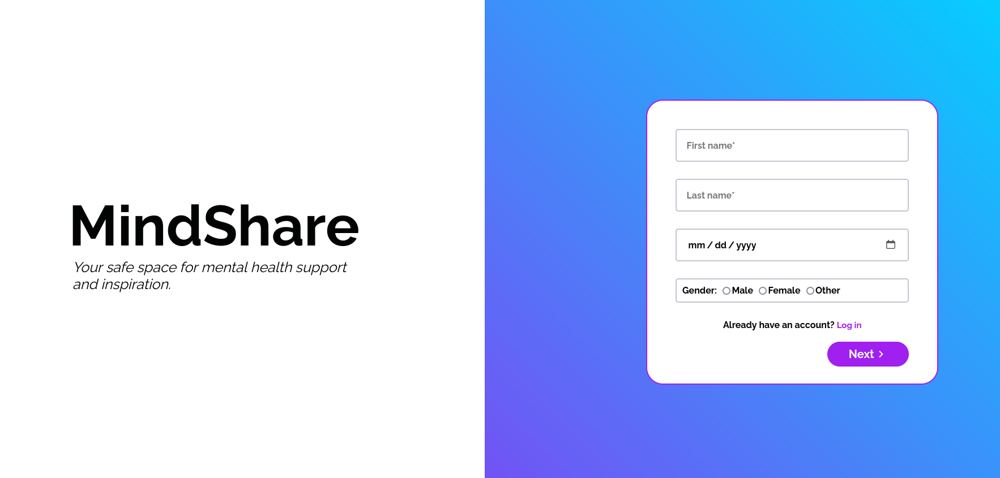

# MindShare
Social media platform for sharing your thoughts and ideas with the world.

## Dependencies

### Frontend
- Node.js
- Angular

### Backend
- .NET 
- Entity Framework

## Usage
1. First, clone the repository and install the dependencies for both the frontend and backend.
2. Run the frontend server in the `Client` directory using the command: 
```
npm start
``` 
3. Run the backend server in the `Server` directory using the command:
```
dotnet run
```

## Features
### User authentication
User can register and login to the platform using their username and password. After the user successfully registers, they have to activate their account by clicking on the link sent to their email address. After the user successfully logs in, they are redirected to the home page where they can see the posts of all the users. 

The user can also decide whether they want more security by enabling two-factor authentication. If the user enables two-factor authentication, they will have to enter a code sent to their email address every time they log in.

### Posts
Users can post their thoughts and ideas on the platform. They can also comment on other users' posts.

### Resources
Resources are pieces of content that can help users learn something new. 

### User profile
Users can see the data they provided when they registered on the platform. They can also toggle their 2FA status. 

## Pages
### Login


### Register


###
